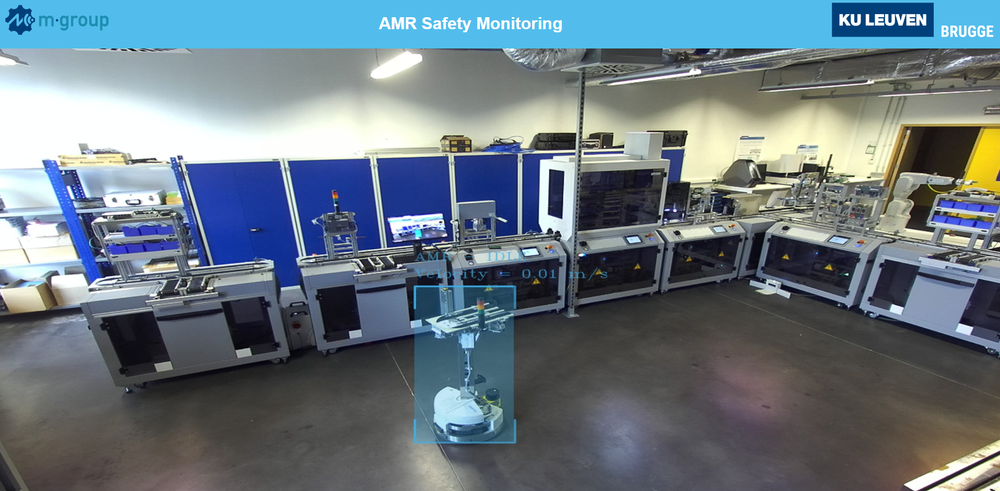

# Ultimate Factory AMR Safety Monitoring



## Installation

Clone this repository to your local working directory.

```bash
git clone https://github.com/MatthiasDR96/uf_amr_safety_monitoring.git
```

Install the Stereolabs ZED Python API via https://github.com/stereolabs/zed-python-api

Install all requirements.

```bash
pip install -r requirements.txt    
```

Or run the code in a Docker environment configured for the project using the .devcontainer extension of Visual Studio Code. 

## Usage

Run the main.py script. The webserver can be accessed via: hostname:8000. It can take a while before the stream starts. 

* Data-collection: Data can be collected using the record_video.py and playback_video.py scripts. The record_video.py script records a video using the ZED camera and saves the .svo2 file to the file you specify. After recording, the playback_video.py script playbacks the recorded video and image captures can be made that generates a database of images from the video. 

* Labelling: For labelling, the raw images can be loaded to Label Studio and labelled according to your preferences. The labels can be exported in YOLO format and saved under the 'data/detection' folder. 

* Training: After labelling, the 'train_yolo.py' script can be used to train a model. 

* Inference: The main.py script loads the customized model and inferes on the stream coming from the ZED camera. 